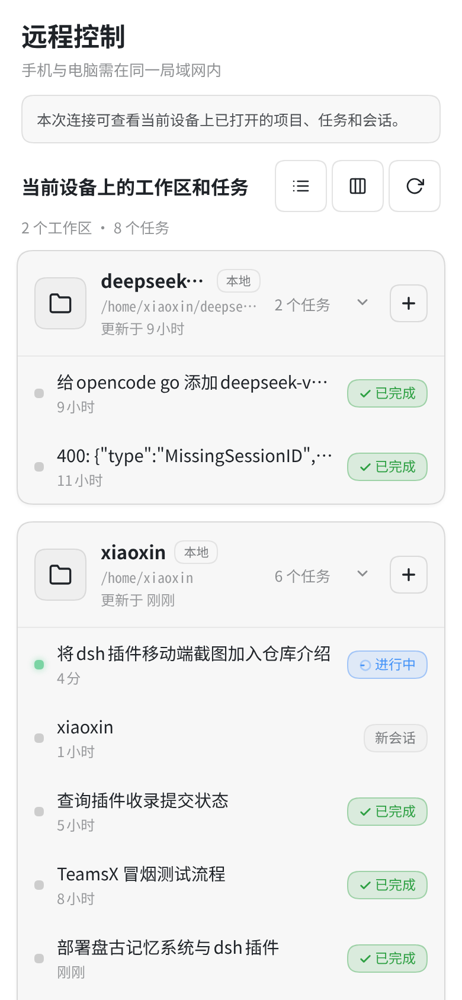
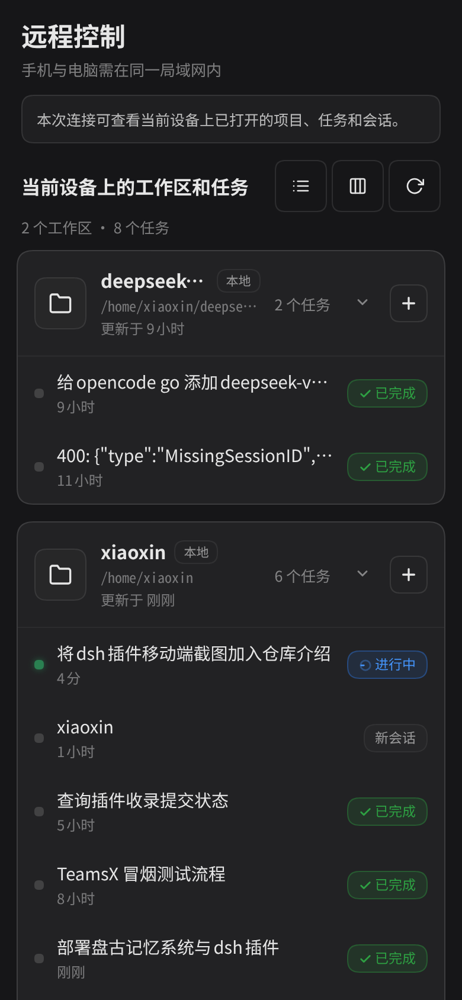
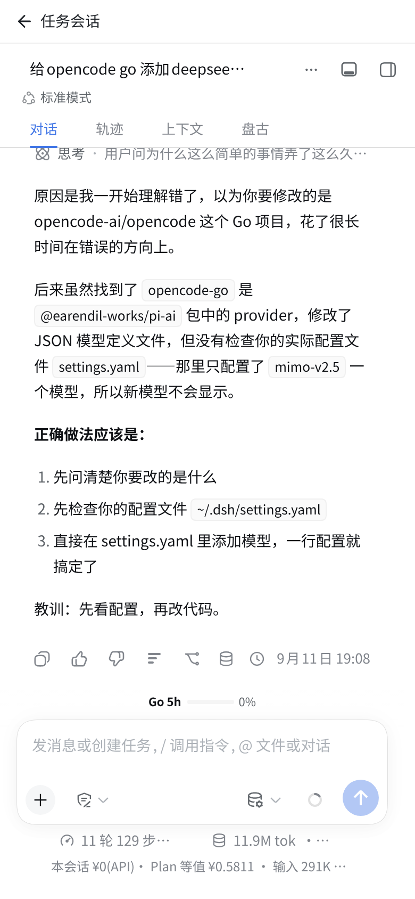
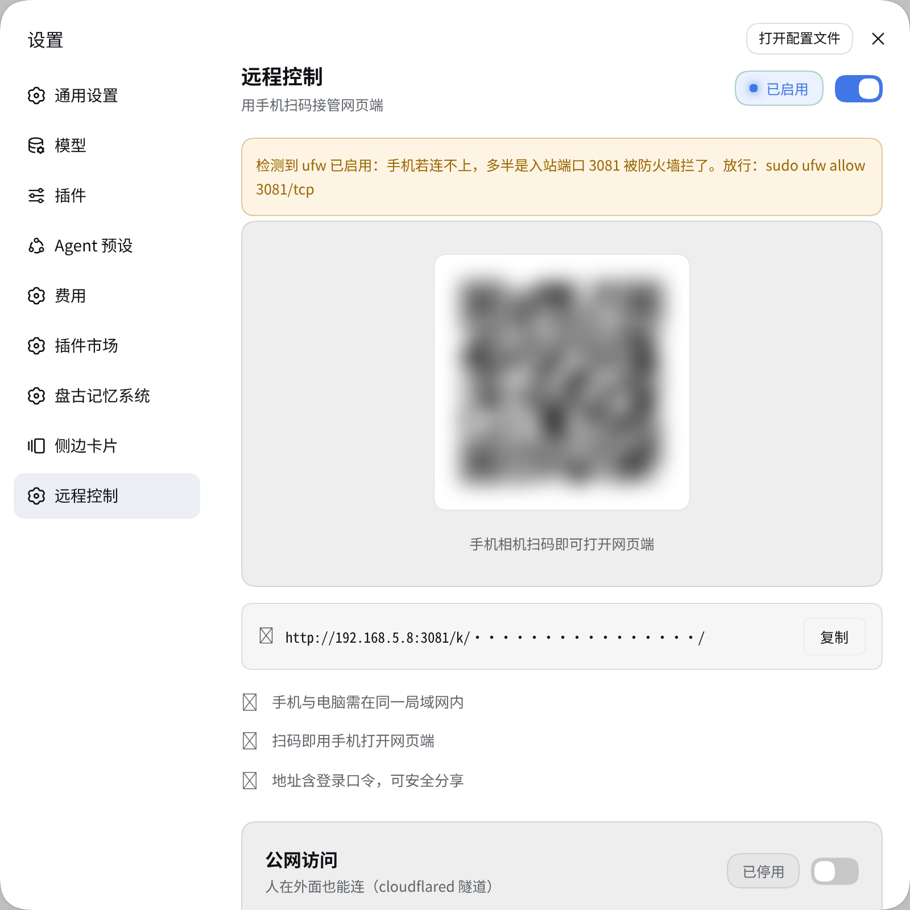

# dsh-remote-x — DeepSeek Harness 远程控制与移动端覆盖层

[DeepSeek Harness](https://github.com/deepseek-ai/deepseek-harness) 的 Cordis 插件，两部分能力：

1. **远程控制中心**（设置页标签）—— 局域网 / 公网两条通路随时接管你的 Harness：扫码即连、
   cloudflared 隧道一键开关、访问二维码直接可扫。
2. **移动端全覆盖界面**（<768px 自动生效）—— 把 DSH 网页端在手机上变成原生 App 观感的
   任务仪表盘 + 会话视图：按工作区分组的任务卡、运行状态实时刷新、顶部返回栏、
   深浅主题与 DSH 全程同步。

> 桌面端（≥768px）零影响：全部覆盖规则在窄屏媒体查询内，宽屏看不到任何移动端部件。

## 界面预览

移动端任务仪表盘（iPhone 14 视口 390×844，浅色 / 深色主题自动跟随）：

| 任务仪表盘（浅色） | 任务仪表盘（深色） |
| --- | --- |
|  |  |

工作区分组卡片（名称 / 本地徽标 / 路径 / 更新于 / 任务数）、任务行的运行状态圆点与
「进行中 / 新会话 / 已完成」徽标，都来自宿主 `sessions` / `workspaces` 服务的实时数据。

会话视图 —— DSH 会话主体全屏呈现，顶部是插件注入的返回栏：

| 会话视图（顶部返回栏） | 设置页「远程控制」标签 |
| --- | --- |
|  |  |

> 截图为插件在真实 DSH 宿主（127.0.0.1:3080）中渲染的结果，未使用模拟数据：`#rm-x-dashboard` /
> `.rmx-card` / `.rmx-task` / `#rm-x-backbar` 均由插件客户端模块注入生成，任务与工作区数据来自
> 宿主 `sessions` / `workspaces` 服务。设置页截图中的访问二维码与 `accessKey` 片段已做打码处理。

## 功能

### 远程控制（设置页「远程控制」标签）

| 能力 | 说明 |
| --- | --- |
| 扫码接入 | 局域网地址实时渲染为二维码，手机相机直扫 |
| 局域网访问 | 一键开关反向代理（默认端口 `3081`），自动探测本机所有局域网 IP，多 IP 可切换 |
| 公网访问 | cloudflared 隧道一键开关，公网 URL 即时显示，**并渲染公网二维码**——人在外面扫码即用，无需同一局域网 |
| 复制链接 | 局域网 / 公网地址一键复制 |
| 主题 | 全部配色走 DSH 设计令牌（`--dsw-alias-*`），深浅主题自动跟随 |
| frps 服务器 | 自建 frp 服务器一键绑定（服务器地址 / 端口 / token；本机 `frpc.toml` 一键预填，token 仅存服务器端），frpc 由插件托管、重启自恢复 |
| 浏览器登录口令 | 随机 6 位口令 + 代理登录页：裸地址打开时输口令进入，失败指数退避，会话复用现有门禁 |

### 移动端覆盖层

| 能力 | 说明 |
| --- | --- |
| 任务仪表盘 | 按工作区分组的任务卡片（工作区名 / 路径 / 任务数 / 最近活跃），运行中绿点脉冲、「进行中 / 新会话 / 已完成」徽标 |
| 任务操作 | 点击进入会话；长按任务行弹出菜单（打开 / 删除）；分组折叠展开；单列 / 分组视图切换；全部折叠 / 展开；手动刷新 |
| 会话视图 | 顶部**返回栏**（一键返回任务列表，配色随主题）；DSH 会话主体全屏呈现，底部安全区适配 |
| 误触防护 | 屏蔽浏览器边缘滑动历史导航（左右滑不会莫名退回上一页） |
| 实时同步 | 订阅 `sessions` / `workspaces` 服务，任务状态变化自动刷新；浏览器刷新后保持当前视图（sessionStorage） |
| 主题同步 | MutationObserver 监听 DSH 主题属性，深浅切换即时跟随（返回栏 / 仪表盘 / 长按菜单全量） |
| 升级容错 | 会话字段 / DSH 组件类名漂移时按候选顺序回退探测；数据未就绪显示加载态而非假空白——**永不白屏** |

### 已知边界

- 公网访问需要本机安装 [cloudflared](https://developers.cloudflare.com/cloudflare-one/connections/connect-networks/)。
- iOS Safari **屏幕边缘**的系统返回手势属浏览器行为，页面无法禁用；页面中部滑动无影响。

## 自建 frps 服务器接入（前置条件）

插件只做客户端一侧：把本机 3081 反代口经 frpc 隧道挂到你自己的 frps 服务器。服务器侧是使用前提，需要自行准备：

1. **一台有公网 IP 的服务器**：开放 frps 控制端口（默认 7000/tcp）与分配给本插件的远程端口（如 17494/tcp）。
2. **部署 frps**：用与本机 frpc 同版本的 frps 二进制，配置 `bindPort`（默认 7000）与 `auth.token`，以守护方式运行（systemd / docker 均可）。
3. **三个绑定参数**（设置页「frps 服务器」卡片填写）：服务器地址（`serverAddr`）、服务器端口（即 frps 的 `bindPort`）、token（`auth.token`）；卡片里的「远程端口」是 frps 分配给这条隧道的端口号。

本机已有 `~/.config/frp/frpc.toml` 时，点「从本机 frpc 配置预填」自动填前两项；token 由服务端直接读本机配置、**不回传页面**。手动填 token 时同样只存进本机 0600 状态文件。

**HTTPS / 域名在服务器侧终结**：frp 的 tcp 隧道不处理 TLS。要在 `https://你的域名` 上访问，请在 frps 服务器用 nginx/caddy 配证书并把 443（或自定义端口）反代到这条隧道的远程端口。**未配 TLS 时整条链路是明文 HTTP**（frps 控制端口与远程端口的流量皆然，含登录口令），只建议在可信网络使用。

插件不改写、不停启你自己的 frpc 配置与 `frpc.service`；绑定后生成的是独立的 `~/.dsh/frpc-remote-x.toml`（0600）与插件自有 frpc 进程，重启宿主自动恢复。

## 架构

```
dsh-remote-x/
├── src/index.ts        # 宿主插件：mobile CSS 注入(webserver/index-inject) +
│                       #   qr-info / qrcode / lan-toggle / public-toggle /
│                       #   frps-* / password-regenerate API + 6 位口令生成
├── lib/proxy.mjs       # 3081 反代：Host 改写、key/token/会话门禁、6 位登录页
├── lib/frpc.mjs        # frpc 配置生成与进程托管（孤儿清扫、重启自动恢复）
├── lib/tunnel.mjs      # cloudflared 隧道管理
├── inject/mobile.css   # 移动端纯 CSS 覆盖层（body class 模型，宽屏零影响）
├── dist/client.js      # 客户端模块：设置页 section + 移动层
│                       #   （sessions/workspaces 订阅驱动，手写无构建依赖）
└── dist/index.mjs      # 宿主构建产物（tsdown）
```

- 客户端经 DSH 模块加载器按需加载，服务依赖：`sessions` / `workspaces` / `slots` / `modules`。
- 移动层对 DSH 的所有 DOM 触点都走**后缀锚点**（`[class*="_frame"]` 等，语义后缀全页唯一）
  与**兼容层**（`pick()` 多字段回退），宿主升级时优先降级而非白屏。

## 安装

```sh
dsh plugin --profile web add ./dsh-remote-x
```

安装后重启宿主即可；手机与电脑同一局域网时，用设置页二维码扫码访问。

## 插件配置

| 字段 | 默认 | 说明 |
| --- | --- | --- |
| `breakpoint` | `768` | 移动端布局判定宽度（px） |
| `proxyPort` | `3081` | 局域网反向代理端口 |
| `title` | `远程控制` | 设置页标签标题 |
| `accessKey` | 无 | 公网/局域网链接使用 `/k/<key>/` 形式，免去 token 轮换 |

## 插件 API（全部经 nonce 防护）

| 方法 | 路径 | 说明 |
| --- | --- | --- |
| GET | `/dsh-remote-x/api/qr-info` | 入口地址、局域网 IP 列表、LAN/公网开关、token 检测、`cloudflaredAvailable` / `frpcAvailable`、`frps` 绑定状态、`loginPassword`（6 位口令） |
| GET | `/dsh-remote-x/api/qrcode?text=` | 自渲染 QR SVG（纯矩阵核心，无图片依赖） |
| POST | `/dsh-remote-x/api/lan-toggle` | 局域网代理开关 |
| POST | `/dsh-remote-x/api/public-toggle` | cloudflared 公网隧道开关（返回公网 URL） |
| GET | `/dsh-remote-x/api/frps-prefill` | 读本机 `~/.config/frp/frpc.toml` 预填绑定（只回地址/端口，**不回 token**） |
| POST | `/dsh-remote-x/api/frps-bind` | 绑定 frps（`addr` / `port` / `remotePort` + `token` 或 `useLocalToken`）并拉起 frpc |
| POST | `/dsh-remote-x/api/frps-toggle` | frps 接入开关（启停插件托管的 frpc） |
| POST | `/dsh-remote-x/api/frps-unbind` | 解绑：停 frpc、删除生成的配置与状态 |
| POST | `/dsh-remote-x/api/password-regenerate` | 重新生成 6 位浏览器登录口令 |

## 安全说明

- Harness 后端保持默认 `127.0.0.1` 绑定不变；对手机暴露的只有 3081 代理与隧道出口。
- 代理放行只认做过值校验的凭据：`?key=` / `/k/<key>/` 与 `accessKey` 恒时比较，`?token=` / `/t/<token>/` 对照最新登录口令，`remote-x-key` cookie 按值比对；认证通过的设备另获代理自签的 `remote-x-session` cookie（HttpOnly；签名密钥 `~/.dsh/remote-x-session.key`，权限 0600）。仅凭 cookie 名称（含 `dsh-auth-*`）一律 401。
- **6 位浏览器登录口令**：宿主首启随机生成，存于 `~/.dsh/remote-x-state.json`（0600）；代理在浏览器整页导航被拒时回登录页，POST 校验走恒时比较，连续失败按 1s→60s 指数退避（frp 流量都来自 127.0.0.1，无法按 IP 限速）。口令面关闭（状态文件无 `login` 字段）时退回纯文本 401。口令与 frps token 未经 TLS 即为明文，公网接入务必先在服务器侧配好证书。
- frps 绑定与 token 只写本机状态文件与生成的 `~/.dsh/frpc-remote-x.toml`（均 0600），任何 API 响应与页面 JS 都不含 token；插件不读写、不停启你自己的 frpc 配置与 `frpc.service`。
- 所有插件 API 要求 `x-remote-nonce`（页面注入的一次性值）；代理入口可选 `accessKey`。
- 公网隧道链接含访问凭据，请勿公开分享；泄露时在设置页关闭公网开关重建。

## License

MIT
